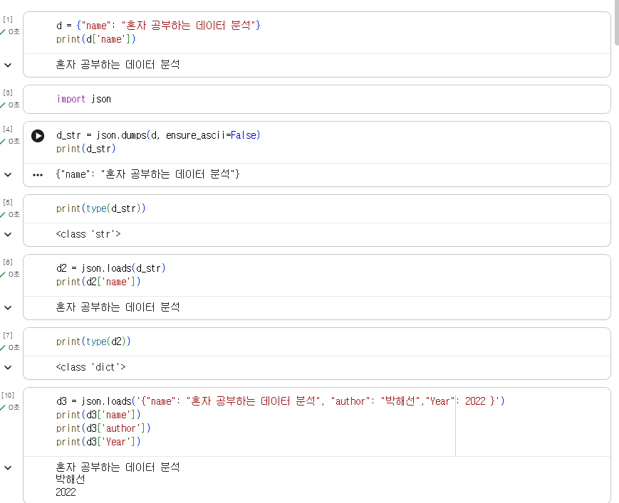
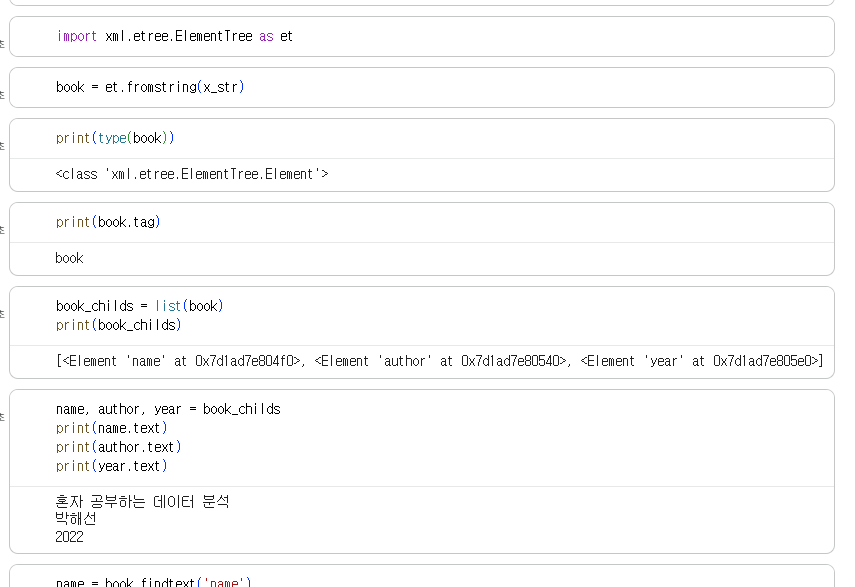

# 데이터분석 2주차 정규과제

📌데이터분석 정규과제는 매주 정해진 분량의 『*혼자 공부하는 데이터 분석 with 파이썬*』 을 읽고 학습하는 것입니다. 이번 주는 아래의 **DataAnalysis_2nd_TIL**에 나열된 분량을 읽고 공부하시면 됩니다.

아래의 문제를 풀어보며 학습 내용을 점검하세요. 문제를 해결하는 과정에서 개념을 스스로 정리하고, 필요한 경우 제시된 강의를 참고하여 보완하는 것이 좋습니다.

<!-- 강의 링크는 아래와 같습니다.
https://www.youtube.com/watch?v=s_-VvTLb3gs&list=PLVsNizTWUw7FGzSRCkQrPEEe-ljVXgS7k&index=4
https://www.youtube.com/watch?v=Il6L8OtNFpc&list=PLVsNizTWUw7FGzSRCkQrPEEe-ljVXgS7k&index=5
-->


## DataAnalysis_2nd_TIL

### 2장 데이터 수집하기
#### 01. API 사용하기
#### 02. 웹 스크래핑 사용하기


## Study Schedule

| 주차  | 공부 범위     | 완료 여부 |
| ----- | ------------- | --------- |
| 1주차 | p.24~81    | ✅         |
| 2주차 | p.84~151   | ✅         |
| 3주차 | p.154~219  | 🍽️         |
| 4주차 | p.222~279 | 🍽️         |
| 5주차 | p.282~325 | 🍽️         |
| 6주차 | p.328~379 | 🍽️         |
| 7주차 | p.382~430 | 🍽️         |

<br>

<!-- 여기까진 그대로 둬 주세요-->


# 1️⃣ 개념 정리 

## 01. API 사용하기

### API란?
인증된 URL만 있으면 언제든지 필요한 데이터에 편리하게 접근할 수 있는 방식
두 프로그램이 서로 대화하기 위한 방법을 정의한 것

### HTTP
인터넷에서 웬 페이지를 전송하는 기본 통신 방법

=> HTTP 프로토콜을 사용해 API를 만듦

### HTML
웹 브라우저가 화면에 표시할 수 있는 문서의 한 종류이자 웹 페이지를 위한 표준 언어

### 파이썬에서 JSON 데이터 다루기
파이썬의 딕셔너리와 리스트를 중첩해 놓은 것과 비슷. 중괄호를 사용하고 키와 값을 콜론(:)으로 연결

#### 파이썬 객체를 JSON문자열로 변환하기: json.dumps() 함수
기본적으로 json.dumps()함수는 아스키 문자 외의 다른 문자를 16진수로 출력함. ensure_ascii 매개변수 = False로 지정하면 한글 출력 가능

#### JSON 문자열을 파이썬 객체로 변환하기: json.loads() 함수
json.loads()함수 사용시, JSON문자열을 직접 전달 가능. 대괄호 안에 여러 항목을 나열하여 배열 표현 가능. 세겹따옴표(""")를 사용하면 여러 줄 문자열 가능

#### JSON 문자열을 데이터프레임으로 변환하기: read_json() 함수
1. read_json() 함수 사용
2. JSON 문자열을 파이썬 객체로 만든 다음, DataFrame 클래스를 사용

### 파이썬에사 XML 데이터 다루기
컴퓨터와 사람이 모두 읽고 쓰기 편한 문서 포맷을 위해 고안됨. 엘리먼트들이 계층 구조를 이루면서 정보를 표현
시작 태그와 종료 태그로 감쌈: 태그는 기호로 시작해서 기호로 끝남
시작 태그와 종료 태그의 이름이 같아야 함

### XML 문자열을 파이썬 객체로 변환하기: fromstring() 함수
Json 패키지는 JSON문자열을 파이썬 객체로 변환<-> fromstring 함수는 ElementTree 모듈 아래에 정의된 Element 클래스의 객체를 반환

#### 자식 엘리먼트 확인하기: findtext() 메서드

#### 여러 개의 자식 엘리먼트 확인하기: findall() 메서드와 for 문

### 파이썬으로 API호출하기: requests 패키지


## 02.웹 스크래핑 사용하기
웹사이트의 페이지를 옮겨 가면서 데이터를 추출하는 작업

#### 데이터프레임 행과 열 선택하기:loc 메서드
인덱스의 위치를 사용. 원하는 매개변수를 리스트로 전달(대괄호 사용)
혹은, 리스트 대신 슬라이스 연산자(:) 사용 가능

#### 검색결과 페이지 HTML 가져오기: requests.get() 함수

### HTML에서 데이터 추출하기: 뷰티플수프
먼저, 원하는 데이터가 HTML 어디에 위치해 있는지 알아야 함-> 크롬브라우저 사용
클래스의 객체 생성: 첫 번째 매개변수는 파싱할 HTML문서, 두 번째는 파싱에 사용할 파서(입력데이터를 받아 데이터 구조를 만드는 소프트웨어 라이브러리) 

#### 태그 위치 찾기: find() 메서드
첫 번째 매개변수에는 찾을 태그 이름을 지정하고, attrs  매개변수에는 찾으려는 태그의 속성을 딕셔너리로 지정

#### 도서 상세 페이지 HTML가져오기
requests.get() 함수 호출-> 상세페이지에서 개발자 도구 열고 select 아이콘 클릭

#### 테이블 태그를 리스트로 가져오기: find_all()  메서드
특정 HTML 태그를 찾아서 리스트로 변환해야 함. 이때 사용하는 게 find_all() 메서드. 

#### 태그 안의 텍스트 가져오기: get_text() 메서드
: 태그 안의 텍스트를 반환

### 전체 도서의 쪽수 구하기
데이터프레임을 for문으로 반복하는 건 아주 비효율적임. 순차적으로 하나의 함수로 만들어보는 것이 좋음
-> 새로 만든 get_page_cnt2() 함수를 apply() 메서드에 사용 axis 메서드를 사용하면 행또는 열에 함수 일괄적용

람다 함수: 함수 이름 없이 한 줄로 쓰는 함수. 코드 간결하게 작성.

### 데이터프레임과 시리즈 합치기: merge() 함수
판다스에서 두 데이터프레임을 합치거나, 데이터프레임과 시리즈를 합칠 때 사용

### 웹 스크래핑 시 주의할 점
웹사이트에서 스크래핑 허용하였는지 확인
HTML태그 특정할 수 있는 지 확인.


# 2️⃣ 수행 인증

<!-- 교재에서 안내된 과정을 직접 실행해본 뒤, 진행 결과가 보이도록 4~6장의 스크린샷을 캡처하여 아래에 첨부해주세요.-->





<br>
<br>

# 3️⃣ 확인 문제

## 문제 1.

> **🧚Q. 다음 중 BeautifulSoup 외에 웹 스크래핑에 사용할 수 있는 파이썬 패키지로 가장 적절한 것은 무엇인가요?**

```
1️⃣ NumPy  
2️⃣ Scrapy  
3️⃣ Matplotlib  
4️⃣ Scikit-learn  
```

```
2번 Scrapy, BeautifulSoup이 HTMK을 파싱하는 도구라면, Scrapy는 request와 뷰티풀스프를 합쳐 놓은 것과 비슷
```


### 🎉 수고하셨습니다.